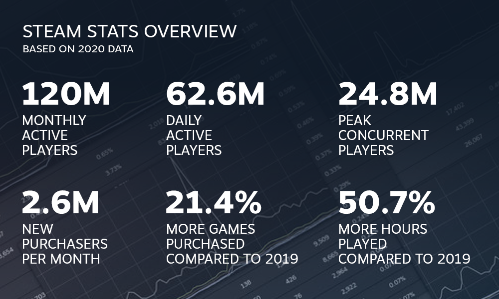

```{r setup, message=FALSE, warning=FALSE}
library(tidyverse)
library(lubridate)
library(plotly)
library(gridExtra)
library(kableExtra)
library(scales)
options(scipen = 999) #0 to reset to default
knitr::opts_chunk$set(echo = TRUE, message=FALSE, warning=FALSE, fig.width = 10, fig.height = 3)
```

<hr style="border:1px solid gray"> </hr>

## What this project entails and what it hopes to achieve

The Global Games Market reached $175 billion USD in revenue in 2020 and an additional 9.4% growth is projected by [Newzoo](https://newzoo.com/insights/articles/game-engagement-during-covid-pandemic-adds-15-billion-to-global-games-market-revenue-forecast/), a leading market research company. Although PC gaming occupy the lowest share (22%) in 2020, the pandemic has accelerated the PC market share due to the new work from home regime. Coupled with the rising popularity of E-Sports, PC gaming is set to grow as high as [25%](https://www.safebettingsites.com/2020/12/14/global-gaming-pc-shipments-to-jump-by-25-and-hit-62-million-in-2024/) in the next 3 years.

\


\

Furthermore, the annual report published by [Steam](https://store.steampowered.com/news/group/4145017/view/2961646623386540826) for 2020 reported not only increased number of users, but up to 50% more playtime.



\

As I am from the video games industry, and we are looking to grow our PC market share, I hope to uncover some key insights to help plan our strategy such as:

* Which games are trending over time?
* What genre do they belong to?
* Any smash-hit titles that have outperformed industry expectations?
* What benchmarks can we set upon ourselves to measure if a game is going to be a success?

\

<hr style="border:1px solid gray"> </hr>

## Selecting the dataset and defining the variables

The main three datasets I have selected for this study is a webscrapped version of the steamcharts/steamsdb website. These data from these sites are pulled via public Steam APIs, so there's trustworthiness in the accuracy there.

\

__Dataset 1: Monthly users for top 1,200 games from 2012 to 2020__ \
_[Source - Kaggle](https://www.kaggle.com/michau96/popularity-of-games-on-steam)_ \

``` {r import data 1, message=FALSE, warning=FALSE}
steam_monthly <- read_csv("datafiles/SteamCharts.csv", col_types = 'cccdddd')
head(steam_monthly)
```
_gamename - name of game title in Steam store_ \
_avg - average number of daily concurrent users for a specific game in that month/year_ \
_gain - delta of avg from previous month_ \
_peak - highest number of daily concurrent users for a specific game in the month/year_ \
_avg_peak_perc - % of avg over peak_ \

\

__Dataset 2: Total Steam Peak CCU and Total in-game Peak CCU from 2012 to 2020__ \
_[Source - SteamDB](https://steamdb.info/app/753/graphs/)_ \

``` {r import data 2, message=FALSE, warning=FALSE}
steam_total <- read_csv("datafiles/SteamCharts_Total.csv", col_types = 'ccdddddd')
head(steam_total)
```
_peak - highest number of daily concurrent users for Steam (gaming + idle) in the month/year_ \
_gain_perc - delta of peak from previous month_ \
_peak_daily_min - lowest number of daily concurrent users for Steam (gaming + idle) in the month/year_ \
_peak_daily_avg - average number of daily concurrent users for Steam (gaming + idle) in that month/year_ \
_peak_ingame - highest number of daily concurrent users who are playing a game in that month/year_ \

\

__Dataset 3: Positive and Negative ratings for each game in 2020__ \
_[Source - SteamDB](https://steamdb.info/stats/gameratings/)_ \

``` {r import data 3, message=FALSE, warning=FALSE}
steam_reviews <- read_csv("datafiles/SteamCharts_Review.csv", col_types = 'cddd')
head(steam_reviews)
```
_gamename - name of game title in Steam store_ \
_postive - total number of positive reviews to date_ \
_negative -total number of positive reviews to date_ \
_rating - % of positive reviews over total reviews, [adjusted for games with less than 100 reviews](https://steamdb.info/blog/steamdb-rating/)_ \

\

<hr style="border:1px solid gray"> </hr>

## Exploratory data analysis

The initial loading of the data show separate columns for year and month, and this would prevent any form of time-series visualization. Thus, the first step of data cleaning will be converting to a proper date and dropping the two columns (year, month) for both steam_monthly and steam_total data frames.

``` {r clean dates, class.source = 'fold-show', message=FALSE, warning=FALSE}
steam_monthly <- steam_monthly %>%
                    mutate(datemonth = dmy(paste(1, month, year)), .before = gamename) %>%
                    select(-c(year, month))

steam_total <- steam_total %>%
                    mutate(datemonth = dmy(paste(1, month, year)), .before = month) %>%
                    select(-c(year, month))
```

\

### 1. Summary statistics for steam_monthly

Based on the summary statistics, the data covers from Jul 2012 to Feb 2021 but not all games will have the full range. There's some problems with the data, particular the zero values in <font color = "red">avg</font> and <font color = "red">peak</font> variables. Furthermore, it seems the data is heavily skewed, with the maximum value being a lot larger than the median. There is also 1,252 NA values in <font color = "red">gain</font>, which could indicate games with missing month data. NAs in <font color = "red">avg_peak_perc</font> are caused by zero values in peak, as division by zero will give you an error. In the context of tracking concurrent users (CCU), having zero values means either your game is being played without an internet connection, or Steam has blocked traffic from client side due to cheating/hacking/game files modification.

``` {r first look df1, message=FALSE, warning=FALSE, fig.width = 10, fig.height = 4}
summary(steam_monthly)
paste("There are a total of", n_distinct(steam_monthly$gamename), "distinct game titles in the data frame.")
```

\

If we look at the top 20, it is very evident why the distribution is skewed so. The top 3 games - PUBG, Dota 2 and Counter-Strike, have trends that are very far from the rest of the top 20. Even within the top 3, PUBG had such a huge spike in the initial few months before declining.

``` {r df1 top 20, message=FALSE, warning=FALSE, fig.width = 10, fig.height = 4}
steam_games_summary <- filter(steam_monthly, avg > 0) %>%
                            group_by(gamename) %>%
                            summarize(avg_avg = mean(avg),
                                      avg_med = median(avg),
                                      avg_min = min(avg),
                                      avg_max = max(avg),
                                      avg_sum = sum(avg),
                                      min_month = min(datemonth),
                                      max_month = max(datemonth),
                                      n = n()) %>%
    mutate(no_of_months = interval(min_month, max_month) %/% months(1) + 1) %>%
    relocate(min_month:no_of_months, .before = avg_avg) %>%
    arrange(desc(avg_avg))

steam_monthly$gamename <- factor(as.factor(steam_monthly$gamename), levels = steam_games_summary$gamename, ordered = TRUE)

filter(steam_monthly, gamename %in% pull(steam_games_summary %>% head(n = 20), 1)) %>%
ggplot() +
  geom_line(aes(x = datemonth, y = avg, color = gamename), size = 0.2) +
  scale_linetype_manual(values = c("TRUE" = "solid", "FALSE" = "dotted")) +
  labs(title = "Monthly CCU for top 20 games", color = "Descending order", y = "average CCU") +
  guides(col = guide_legend(nrow = 10)) +
  scale_color_manual(values = rainbow(20))

```

\

The confidence interval for average CCU hovers near the median of 2795, and if we look at the distribution spread (by bins of 2,000), you can see a huge spike in records that fall below 2000. Upon adjusting the bins and having a zoomed in look on the data, there seems to be an unusually large amount of records (41k, which is almost half of the dataset) that fall below 200 average CCU. Putting into context that this dataset represents the top 1,200 games, these records could be data errors or early access to the game before it was launched. Plus, if you look at the actual values, it's not a whole number either so it might very well be an estimation from the server logs after all.

``` {r df1 histogram, message=FALSE, warning=FALSE, fig.width = 10, fig.height = 4}

cat("The 95% CI for [avg] is", paste(round(confint(lm(avg ~ 1, steam_monthly, level = 0.95))), collapse=" - "))

ggplot(steam_monthly, aes(x = avg)) +
  geom_histogram(binwidth = 2000) +
  labs(title = "Distribution of average CCU by bins of 2,000", subtitle = "Full data view")

ggplotly(
ggplot(steam_monthly, aes(x = avg)) +
  geom_histogram(binwidth = 100) +
  coord_cartesian(xlim = c(0, 5000)) +
  labs(title = "Changed bins to 100, zoomed into more granularity")
)

filter(steam_monthly, avg > 1 & avg < 200) %>%
  arrange(avg) %>%
  head()
```

\

On the other hand, there also doesn't seem to be any impact to CCU with more months after launch as seen from the correlation number.

``` {r df1 correlation, message=FALSE, warning=FALSE, fig.width = 10, fig.height = 4}
ggplot(steam_games_summary) +
  geom_point(aes(x = n, y = avg_avg), alpha = 0.5) +
  geom_text(aes(x = n, y = avg_avg, label = ifelse(gamename %in% pull(steam_games_summary %>% head(n = 3), 1), as.character(gamename), "")), hjust = 1, vjust = 1) +
  labs(title = "Avg CCU vs Number of Months for all games", x = "number of months", y = "average CCU")

paste("The correlation between avg and number_of_months is", cor(steam_games_summary$avg_avg, steam_games_summary$n))

```

\

__Games with missing months__ \

As seen below, there are 75 games (about 6%) with irregular month data. The top game (Mount & Blade II: Bannerlord) in this list has 39 missing months from the data, which basically renders it sub-par when it comes to time-series plotting. \

Looking at the line charts, it becomes very evident that these games have an initial spike in numbers and regulated in the following months. This is not unusual in this industry as the first month is where the user tries out the game and decide if they are going to continue to play. However, the data is a little odd for some games here (in particular Killing Floor 2, Stellaris and SCUM). There's a trailing almost-zero data point prior to the first spike, and this could be due to data errors or early access to the game (like in the previous histogram EDA). We would definitely need to remove these values before realigning each starting month so we can compare games (i.e. launch month success, first 6 months, etc).

``` {r df1 check missing months, message=FALSE, warning=FALSE, fig.width = 10, fig.height = 4}
steam_games_summary %>%
  filter(n != no_of_months)

filter(steam_monthly, gamename %in% pull(steam_games_summary %>% filter(n != no_of_months) %>% head(n=2), 1)) %>%
ggplot(aes(x = datemonth, y = avg, color = gamename)) +
  geom_line() + geom_point() + labs(title = "Top 2 games with missing data", y = "average CCU") + 
  scale_color_manual(values = rainbow(2))

 filter(steam_monthly, gamename %in% pull(steam_games_summary %>% filter(n != no_of_months) %>% head(n=10) %>% tail(n=8), 1)) %>%
ggplot(aes(x = datemonth, y = avg, color = gamename)) +
  geom_line() + geom_point() + labs(title = "Top #3 - #10 games with missing data", y = "average CCU") + 
  scale_color_manual(values = rainbow(8))
 
```

\

__Final cleanup for [steam_monthly]__ \

Based on the EDA, we can modify the steam_monthly dataframe to exclude average CCU less than 200, and add a new column that calculates the number of months from launch so that we can do a comparison of games.

``` {r df1 data fix, message=FALSE, warning=FALSE, fig.width = 10, fig.height = 4}

steam_monthly <- filter(steam_monthly, avg >= 200)

steam_games_summary <- group_by(steam_monthly, gamename) %>%
                            summarize(avg_avg = mean(avg),
                                      avg_med = median(avg),
                                      avg_min = min(avg),
                                      avg_max = max(avg),
                                      avg_sum = sum(avg),
                                      min_month = min(datemonth),
                                      max_month = max(datemonth),
                                      n = n()) %>%
                            mutate(no_of_months = interval(min_month, max_month) %/% months(1) + 1) %>%
                            relocate(min_month:no_of_months, .before = avg_avg) %>%
                            arrange(desc(avg_avg))

steam_monthly <- steam_monthly %>% 
                    left_join(select(steam_games_summary, c(gamename, min_month))) %>%
                    mutate(mths_after_launch = interval(min_month, datemonth) %/% months(1))

ggplotly(
filter(steam_monthly, gamename %in% pull(steam_games_summary %>% head(n = 5), 1)) %>%
  ggplot() +
  geom_line(aes(x = mths_after_launch, y = avg, color = gamename), size = 0.2) +
  geom_point(aes(x = mths_after_launch, y = avg, color = gamename)) +
  coord_cartesian(xlim = c(0,23)) +
  scale_x_continuous(breaks = seq(0, 1000, by = 1)) +
  scale_linetype_manual(values = c("TRUE" = "solid", "FALSE" = "dotted")) +
  labs(title = "Top 5 games monthly average CCU", subtitle = "First 2 years after launch", color = "Descending order", y = "average CCU") +
  guides(col = guide_legend(nrow = 10)) #+
  #scale_color_manual(values = rainbow(20))
)

ggplotly(
filter(steam_monthly, gamename %in% pull(steam_games_summary %>% head(n = 15) %>% tail(n = 10), 1)) %>%
  ggplot() +
  geom_line(aes(x = mths_after_launch, y = avg, color = gamename), size = 0.2) +
  geom_point(aes(x = mths_after_launch, y = avg, color = gamename)) +
  coord_cartesian(xlim = c(0,23)) +
  scale_x_continuous(breaks = seq(0, 1000, by = 1)) +
  scale_linetype_manual(values = c("TRUE" = "solid", "FALSE" = "dotted")) +
  labs(title = "Top 6-15 games monthly average CCU", subtitle = "First 2 years after launch", color = "Descending order", y = "average CCU") +
  guides(col = guide_legend(nrow = 10)) #+
  #scale_color_manual(values = rainbow(20))
)
                         
```

\

### 2. Summary statistics for steam_total \

Looking at the summary statistics for total steam data, we can see that the date stretches back further than the previous dataset, covering Jan 2004 to Mar 2021. If we look at the four CCU metrics, peak, the max (<font color = "red">peak</font>), min (<font color = "red">peak_daily_min</font>) and average (<font color = "red">peak_daily_avg</font>) have very similar distributions with high outliers especially at the tail end. For <font color = "red">peak_ingame</font>, the data seems to be incomplete as there must be a large amount of zero values for the median to be zero as well.

``` {r first look df2, message=FALSE, warning=FALSE}
summary(steam_total)
```

\

If we plot out the variables in a line chart, we can see immediately that the outliers are simply a result of a fast growing trend. However for <font color = "red">peak_ingame</font>, there is only data starting somewhere in 2017. Even so, there is still a strong (> 0.8) positive correlation between those variables which isn't suprising as you would expect number of people actually playing games will increase as the number of people online goes up.

``` {r df2 check missing months, message=FALSE, warning=FALSE, fig.width = 10, fig.height = 4}
chart1a <- ggplot(data = steam_total, aes(x = datemonth)) +
            geom_line(aes(y = peak, color = "Peak CCU (Max)")) + 
            geom_point(aes(y = peak, color = "Peak CCU (Max)")) + 
            geom_line(aes(y = peak_daily_min, color = "Peak CCU (Min)")) + 
            geom_point( aes( y = peak_daily_min, color = "Peak CCU (Min)")) + 
            geom_line(aes(y = peak_daily_avg, color = "Peak CCU (Average)")) +
            geom_point(aes( y = peak_daily_avg, color = "Peak CCU (Average)")) +
            theme(legend.title = element_blank(), axis.title.y = element_blank(), legend.position = "bottom") +
            labs(title = "Min/Avg/Max CCU (Gaming + Idle) by month")

chart1b <- ggplot(steam_total, aes(x = datemonth, y = peak_ingame, color = "Peak In-Game CCU (Average Daily)")) + 
            geom_line() + 
            geom_point() +
            theme(legend.title = element_blank(), axis.title.y = element_blank(), legend.position = "bottom") +
            labs(title = "Avg CCU (Gaming) by month")

grid.arrange(chart1a, chart1b, ncol = 2)
paste("The correlation between peak_daily_avg and peak_ingame is", cor(steam_total$peak_daily_avg, steam_total$peak_ingame))
paste("The correlation between peak_daily_min and peak_ingame is", cor(steam_total$peak_daily_min, steam_total$peak_ingame))
paste("The correlation between peak_daily_max and peak_ingame is", cor(steam_total$peak, steam_total$peak_ingame))
```

\

The <font color = "red">avg</font> from <font color = "green">steam_monthly</font> data frame is a subset of <font color = "red">peak_ingame</font> in this data frame, so it is crucial to understand where the date range overlaps. As seen below, <font color = "red">peak_ingame </font> only has data starting from Nov-2017, but there is also a strong (> 0.9) positive correlation between the CCUs in the two data frames. So we could technically look at using linear model to predict the numbers prior to Nov-2017.

``` {r df1 compare d2 months, message=FALSE, warning=FALSE}
steam_monthly_agg <- group_by(steam_monthly, datemonth) %>%
  filter(avg > 0) %>%
  summarize(avg_mean = mean(avg),
            avg_max = max(avg))

  ggplot() + 
  geom_line(data = steam_monthly_agg, aes(x = datemonth, y = avg_max, color = "Max CCU (steam_monthly)")) +
  geom_point(data = steam_monthly_agg, aes(x = datemonth, y = avg_max, color = "Max CCU (steam_monthly)")) +
  geom_line(data = steam_total, aes(x = datemonth, y = peak_ingame, color = "In-game (steam_total)")) +
  geom_point(data = steam_total, aes(x = datemonth, y = peak_ingame, color = "In-game (steam_total)")) +
  geom_text(data = steam_total, aes(x = datemonth, y = peak_ingame, label = ifelse(datemonth == as.Date("2017-11-01"), "Nov-2017", "")), hjust = 1, vjust = -0.5) +
    scale_x_date(date_breaks = "4 months", date_labels = "%b-%y") + 
    coord_cartesian(xlim = as.Date(c("2017-01-01", "2021-03-01"))) +
    theme(legend.title = element_blank(), axis.title.y = element_blank()) +
    labs(title = "Date range for CCU in both data frames")
  
steam_ccu_corr <- bind_cols(
                            filter(steam_monthly_agg, datemonth > as.Date("2017-10-01"), datemonth < as.Date("2021-03-01")) %>%
                              arrange(datemonth),
                            select(steam_total, c(datemonth, peak_ingame)) %>%
                              filter(datemonth > as.Date("2017-10-01"), datemonth < as.Date("2021-03-01")) %>%
                              arrange(datemonth)
                            )

paste("The correlation between avg (steam_monthly) and peak_ingame (steam_total) for the same period is ", cor(steam_ccu_corr$avg_mean, steam_ccu_corr$peak_ingame))
paste("The correlation between max (steam_monthly) and peak_ingame (steam_total) for the same period is ", cor(steam_ccu_corr$avg_max, steam_ccu_corr$peak_ingame))

```

\

### 3. Summary statistics for steam_reviews \

There's a total of 42,836 unique games and it could also mean this data frame could be containing games that are no longer active. There are zero values for all numeric variables, but it is not surprising to see a game with no positive or negative reviews. However, there is 9 games with zero values in both positive and negative reviews, so we should exclude those as they serve no purpose statistically. There isn't any NA recorded in the dataset, but the distribution seems very right-tailed with huge outliers.

``` {r first look df3, message=FALSE, warning=FALSE}

summary(steam_reviews)

paste("There are a total of", n_distinct(steam_reviews$gamename), "distinct game titles in the data frame.")

filter(steam_reviews, positive == 0 & negative == 0)

```

\

Looking at the charts below, the skewed distribution becomes very apparent. Most of the games have reviews within the IQR range (0 to 1000). It is also worth noticing that the maximum number of positives is about 6 times higher than the maximum number of negatives. There seems to be a strong (> 0.7) positive correlation between positive and negative reviews, but we can't really conclude anything without some time series review data for each game. Furthermore, if we look at the aggregrated rating variables, you can see the distribution is mostly centered around the 60-70% range and most games have at least 25% rating.

``` {r df3 distribution, message=FALSE, warning=FALSE}

paste("The correlation between positive and negative reviews is ", cor(steam_reviews$positive, steam_reviews$negative))

chart2a <- filter(steam_reviews, positive != 0) %>%
              ggplot(aes(positive)) + geom_histogram(fill = "darkgreen") +
              theme(axis.title.y = element_blank()) +
              labs(title = "Distribution of games with positive reviews") +
              scale_y_continuous(limits = c(0, 50000))

chart2b <- filter(steam_reviews, positive != 0) %>%
              filter(positive <= 500) %>%
              ggplot(aes(positive)) + geom_histogram(fill = "darkgreen", binwidth = 10) +
              theme(axis.title.y = element_blank()) +
              labs(title = "Distribution of games with < 500 positive reviews") +
              scale_y_continuous(limits = c(0, 15000)) +
              coord_cartesian(xlim = c(0, 500))

chart2c <- filter(steam_reviews, negative != 0) %>%
              ggplot(aes(negative)) + geom_histogram(fill = "darkred") +
              theme(axis.title.y = element_blank()) +
              labs(title = "Distribution of games with negative reviews") +
              scale_y_continuous(limits = c(0, 50000))

chart2d <- filter(steam_reviews, negative != 0) %>%
              filter(negative <= 500) %>%
              ggplot(aes(negative)) + geom_histogram(fill = "darkred", binwidth = 10) +
              theme(axis.title.y = element_blank()) +
              labs(title = "Distribution of games with < 500 negative reviews") +
              scale_y_continuous(limits = c(0, 15000)) +
              coord_cartesian(xlim = c(0, 500))

grid.arrange(chart2a, chart2b, chart2c, chart2d, ncol = 2, nrow = 2)

ggplot(steam_reviews, aes(rating)) + 
    geom_histogram(color = "white", fill = "darkblue", binwidth = 0.1) +
    stat_bin(binwidth = 0.1, geom="text", aes(label = ..count..), vjust = -0.5) +
    expand_limits(y = c(0,14000)) +
    scale_x_continuous(breaks = c(0.1,0.2,0.3,0.4,0.5,0.6,0.7,0.8,0.9,1.0)) +
    theme(axis.title.y = element_blank()) +
    labs(title = "Distribution of games by ratings (%)")
```

\

If we filter to the games that are present in the <font color = "green">steam_monthly</font> data frame, the distribution doesn't seem that different. However, if we look at the aggregrated rating, you will see most of these 1218 games have around 80-90% rating and the minimum is sits at 50% or more. This adds another layer of confidence that these games are indeed the cream of the crop. However if we test the correlation of reviews against the CCU data, it seems that negative reviews have a higher correlation then positive review, and the aggregrate ratings have almost zero correlation.

``` {r df3 distribution combined with monthly, message=FALSE, warning=FALSE}

steam_reviews_ccu <- inner_join(steam_reviews, steam_games_summary, by = "gamename")

paste("The total number of games with matching reviews is", n_distinct(steam_reviews_ccu$gamename), "/", n_distinct(steam_monthly$gamename))
summary(steam_reviews_ccu)

chart3a <- filter(steam_reviews_ccu, positive != 0) %>%
              ggplot(aes(positive)) + geom_histogram(fill = "darkgreen") +
              theme(axis.title.y = element_blank()) +
              labs(title = "Distribution of games with positive reviews") +
              scale_y_continuous(limits = c(0, 50000))

chart3b <- filter(steam_reviews_ccu, positive != 0) %>%
              filter(positive <= 500) %>%
              ggplot(aes(positive)) + geom_histogram(fill = "darkgreen", binwidth = 10) +
              theme(axis.title.y = element_blank()) +
              labs(title = "Distribution of games with < 500 positive reviews") +
              scale_y_continuous(limits = c(0, 15000)) +
              coord_cartesian(xlim = c(0, 500))

chart3c <- filter(steam_reviews_ccu, negative != 0) %>%
              ggplot(aes(negative)) + geom_histogram(fill = "darkred") +
              theme(axis.title.y = element_blank()) +
              labs(title = "Distribution of games with negative reviews") +
              scale_y_continuous(limits = c(0, 50000))

chart3d <- filter(steam_reviews_ccu, negative != 0) %>%
              filter(negative <= 500) %>%
              ggplot(aes(negative)) + geom_histogram(fill = "darkred", binwidth = 10) +
              theme(axis.title.y = element_blank()) +
              labs(title = "Distribution of games with < 500 negative reviews") +
              scale_y_continuous(limits = c(0, 15000)) +
              coord_cartesian(xlim = c(0, 500))

grid.arrange(chart2a, chart2b, chart2c, chart2d, ncol = 2, nrow = 2)

ggplot(steam_reviews_ccu, aes(rating)) + 
    geom_histogram(color = "white", fill = "darkblue", binwidth = 0.1) +
    stat_bin(binwidth = 0.1, geom="text", aes(label = ..count..), vjust = -0.5) +
    expand_limits(y = c(0,800)) +
    scale_x_continuous(breaks = c(0.1,0.2,0.3,0.4,0.5,0.6,0.7,0.8,0.9,1.0)) +
    theme(axis.title.y = element_blank()) +
    labs(title = "Distribution of games by ratings (%)")

paste("The correlation between avg CCU and positive reviews is", cor(steam_reviews_ccu$avg_avg, steam_reviews_ccu$positive))
paste("The correlation between avg CCU and negative reviews is", cor(steam_reviews_ccu$avg_avg, steam_reviews_ccu$negative))
paste("The correlation between avg CCU and ratings is", cor(steam_reviews_ccu$avg_avg, steam_reviews_ccu$rating))

```

\

But if we plot positive and negative as a scatter plot, you can see that the correlation for negative is heavily skewed due to PUBG having low positive and high negative, and yet having high CCU too.

``` {r }

ggplotly(
ggplot(steam_reviews_ccu) +
  geom_point(aes(x = negative, y = positive, color = gamename, size = avg_avg))
)

```

\

__So does positive, negative and ratings impact average CCU?__ \

If we simply ran a linear model for avg CCU on positive, negative and ratings; we have a high 0.7605 r-squared explaining the dependant variable, and both negative and rating are significant in their p-values. But we know that this is due to PUBG skewing the data.

``` {r df4 hypothesis testing, message=FALSE, warning=FALSE}

lm(avg_avg ~ positive + negative + rating, steam_reviews_ccu, levels = 0.95) %>% summary()

```

\

So if we exclude the top 3 games - PUBG, Counterstrike and Dota, and run the linear model again; immediately we see a lower residual estimates and our standard error drops by half. And although positive and negative are both significant now, the R-squared drops to about 0.5; which is about as good as a coin toss. Based on that, we can only conclude that this reviews data frame have no significant impact on our CCU data.

``` {r df4 hypothesis testing 2, message=FALSE, warning=FALSE}

steam_reviews_ccu_no_top_3 <- filter(steam_reviews_ccu, !(gamename %in% pull(steam_games_summary %>% head(n=3), 1)))

lm(avg_avg ~ positive + negative + rating, steam_reviews_ccu_no_top_3, levels = 0.95) %>% summary()

```

\

<hr style="border:1px solid gray"> </hr>

## So... what's next?

Based on the EDA, we can already draw some conclusions about the trends.

* About 20 million users log in everyday, but 30% (~ 6 million) are actually playing games at the same time.
* The top 3 games - PUBG, Dota 2 and Counter-strike, drives most of the daily user activity.
* Top 20 games have a mean CCU of 133,521, which is about 2% of the daily CCU playing games, which could mean users might be much more fragmented across games.
* Top 1200 games have an average of ~ 80% rating.
* Positive / Negative reviews does not seem to have any significant impact on CCU.

<font color="red">The next steps would be to search for other possible predictive datasets like genres, gametime, player demographics, etc.</font>

